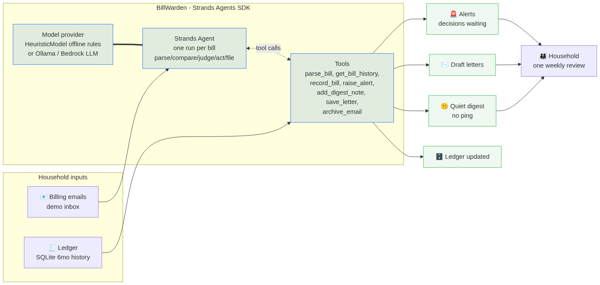

# 🛡️ BillWarden — your household's quiet bill auditor

**BillWarden is an agent built with the [Strands Agents SDK](https://github.com/strands-agents/sdk-python) that reads your household's billing emails, compares every bill against its ledger of history, and pings you *only* when a real decision is needed.** Everything else — seasonal usage, roaming charges, a promo ending exactly as the contract said — is logged quietly in a weekly digest so it never interrupts you.

In the demo run, across 7 realistic household bills, BillWarden:

- 🚨 **caught a +40.1% electricity rate hike** hiding behind flat usage (worth **$59.55/mo**) and drafted a dispute letter,
- 🚨 **caught a duplicate streaming charge** (two receipts, one billing period — **$15.99**) and drafted a refund request,
- 🚨 **flagged a +22% insurance renewal premium** (worth **$24.75/mo**) and drafted a re-quote letter,
- 🤫 and *quietly* filed 4 expected changes — water tiers, roaming, an expiring promo, an unchanged bill — **without a single ping**.

That's **$100.29/month of recurring household money leaks** surfaced as three ready-to-send letters, with zero notification noise for everything that was actually fine.

## Why "quiet by default"

Bill fatigue is real: bill-paying apps blast a notification for every statement, so people mute them and miss the one bill that matters. BillWarden inverts the model — the agent decides *which* changes deserve your attention, using your household's own billing history as ground truth, and files everything else into a digest you read once a week.

## Quickstart (zero downloads, zero API keys)

```bash
pip install -r requirements.txt
uvicorn billwarden.dashboard:app --port 8619
# open http://localhost:8619  →  click "▶ Run weekly audit"
```

The default model provider is **`HeuristicModel`** — a fully offline rule engine that implements the Strands `Model` interface, so the agent loop, tool calls and filings are genuine Strands with no cloud dependency and nothing to sign up for.

Prefer an LLM's judgment instead of rules? Point the same agent loop at any Ollama model:

```bash
BILLWARDEN_MODEL=ollama:qwen2.5:7b-instruct-q4_K_M uvicorn billwarden.dashboard:app --port 8619
```

Headless mode (same audit, terminal output):

```bash
python run_audit.py
```

## How it works

```
📧 billing emails (demo inbox)          🧾 household ledger (SQLite, 6 months of history)
        │                                        │
        ▼                                        ▼
   ┌──────────────── BillWarden — Strands Agent ─────────────────┐
   │  one focused agent run per bill:                            │
   │  parse → compare with history → JUDGE → act → file          │
   │                                                             │
   │  model provider:  HeuristicModel (offline rules, default)   │
   │                   or any Strands provider (Ollama, Bedrock…) │
   └──────────────────────────────────────────────────────────────┘
        │             │              │              │
        ▼             ▼              ▼              ▼
   🚨 alerts      ✉️ draft        🤫 quiet      🗄️ ledger
   (decisions     letters for     digest notes   updated for
   waiting for    every alert     (no ping)      next audit
   the household)
```



**Tools the agent calls** (deterministic, testable Python — the LLM/rule engine never does arithmetic):

| tool | role |
|---|---|
| `parse_bill` | extracts vendor, period, amount, usage, notes from the email |
| `get_bill_history` | pulls the vendor's past bills from the SQLite ledger |
| `record_bill` | files the processed bill so future audits can compare |
| `raise_alert` | a real decision is needed (rate hike, duplicate, renewal jump) |
| `add_digest_note` | an expected change — informed, not interrupted |
| `save_letter` | a ready-to-send dispute/refund/re-quote draft |
| `archive_email` | files the email away, audit trail complete |

**Judgment rules** (what separates a leak from life): the same usage at a higher per-unit rate is a price increase, not lifestyle; two identical charges in one period are a billing error; a renewal premium jump with no claim history is a re-quote opportunity; a promo ending *exactly as the contract scheduled*, seasonal tiers and one-off roaming are expected — informed, not interrupted.

## Design notes

- **Deterministic core, pluggable judgment.** All money math lives in Python tools; the model (rules by default, LLM optionally) only classifies and drafts. This keeps the agent auditable and makes the demo reproducible everywhere.
- **Per-email agent runs.** Each bill gets one focused agent run — parse, compare, judge, act, file — so a single malformed email can never derail the audit, and every decision is traceable in the live event feed.
- **Deterministic backstops.** After each run, the orchestrator guarantees the ledger row exists and every vendor got an explicit decision, so an interrupted model call can never silently drop a bill.
- **Runs anywhere.** CPU-only laptops, air-gapped machines, CI. No keys, no accounts, no data leaves the machine.

## Demo

See the Devpost submission for the demo video. The dashboard at `http://localhost:8619` shows the live agent event feed, the decisions panel, the quiet digest and the draft letters.

## Track

**Everyday Agents** — an agent that takes the busywork out of daily life, home and money, runs quietly in the background and only pings you when there's a real decision to make.

## License

MIT — see [LICENSE](LICENSE).
